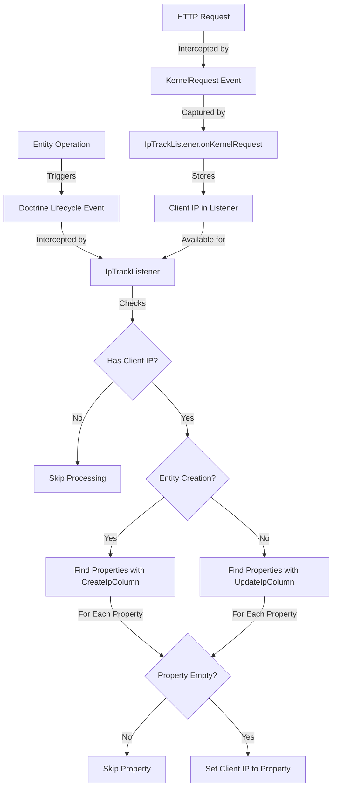
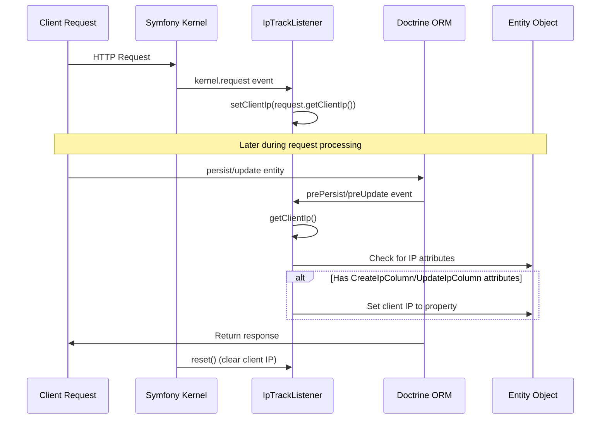
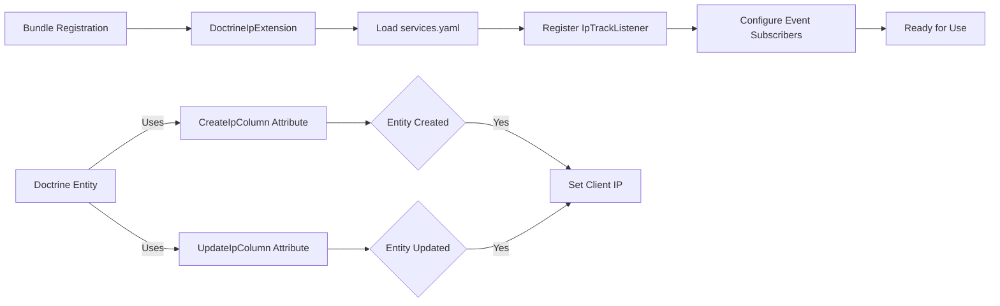

# Doctrine IP Bundle Workflow

This document describes the workflow and data flow of the Doctrine IP Bundle.

## IP Tracking Workflow

## Component Interaction

## Configuration Flow

This workflow documentation illustrates how the Doctrine IP Bundle intercepts HTTP requests to capture client IPs and automatically applies them to entity properties marked with the appropriate attributes during entity creation and updates.
